# Introduction

This repo holds a list of terms every entry level software developer should know and be able to discuss about them.
NOTE: the diagrams are written using PlantUML

# Entry Level

1.  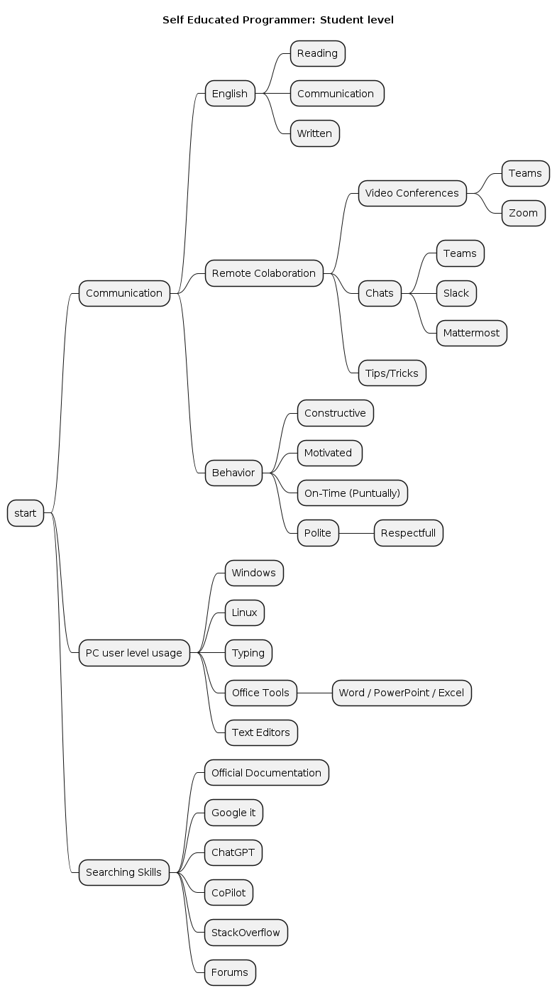

# Junior Level

1. 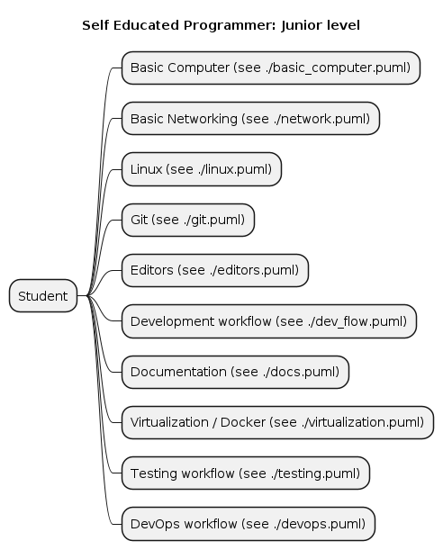
1. 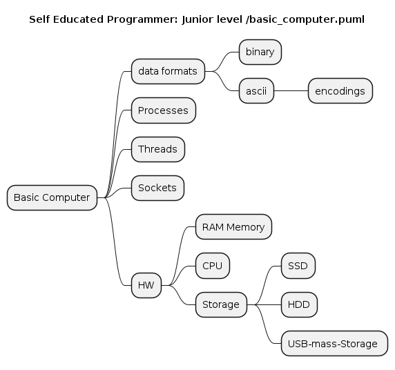
1. 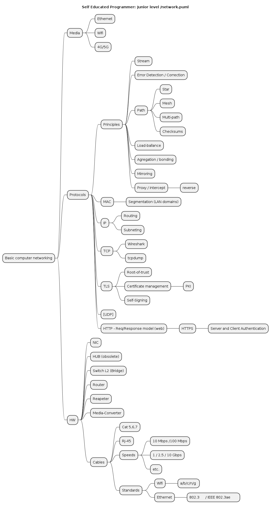
1. 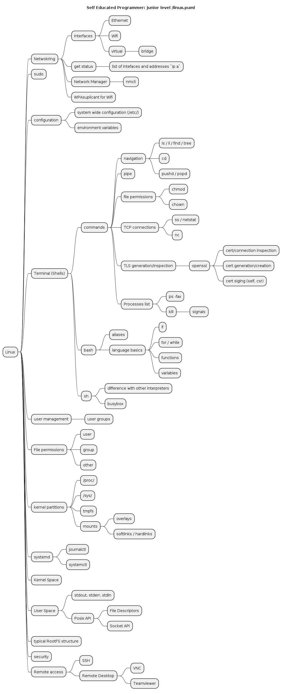
1. 
1. 
1. 
1. 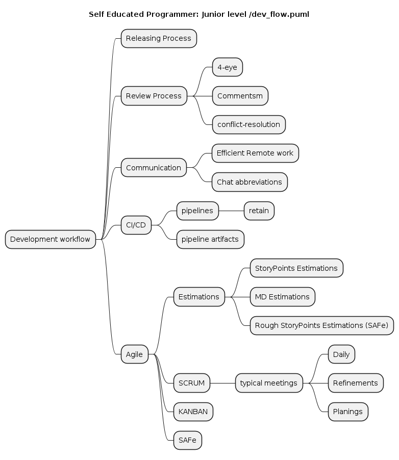
1. 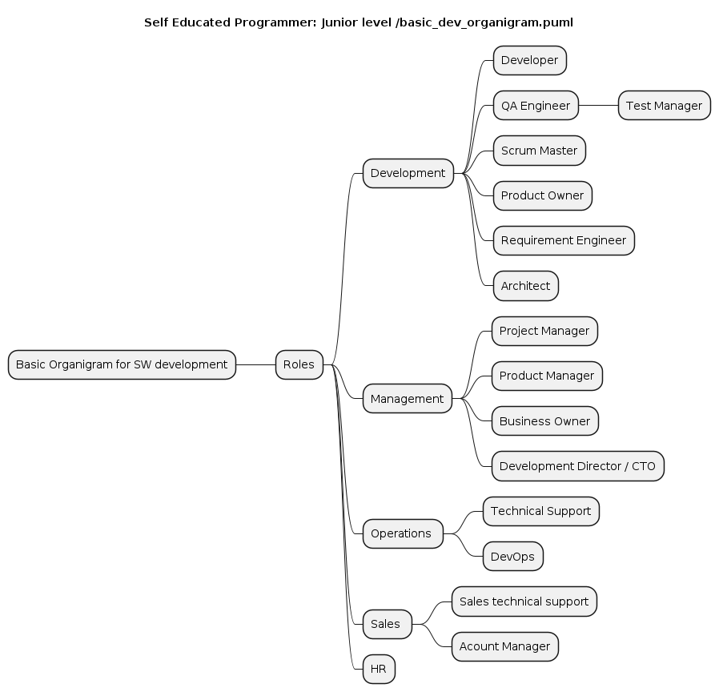
1. 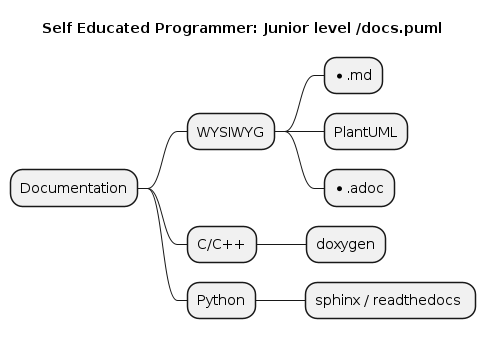
1. 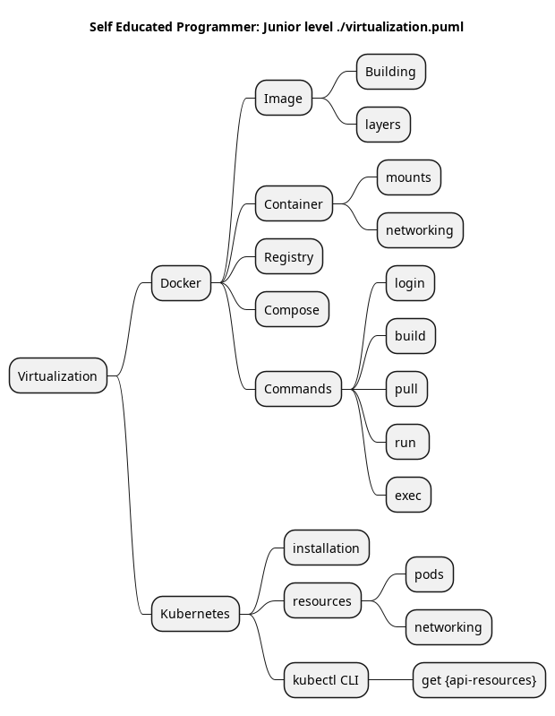
1. 
1. 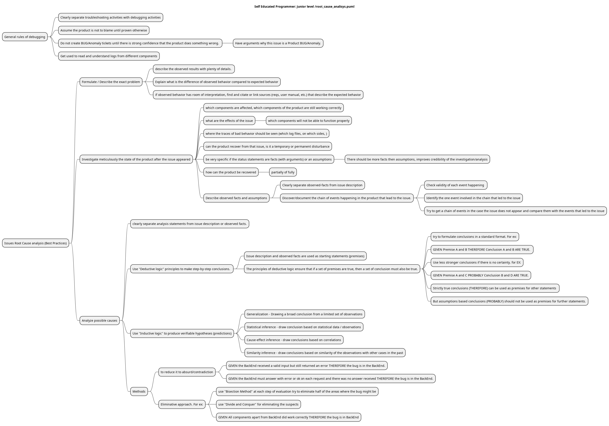
1. 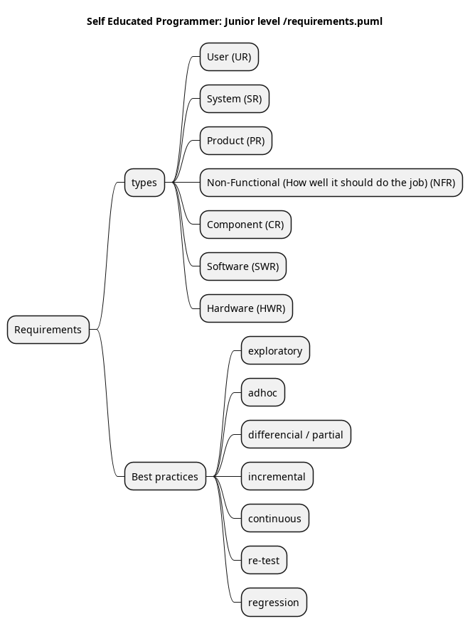
1. 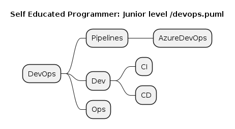
